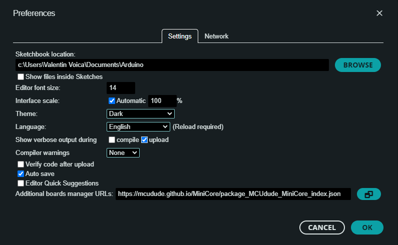
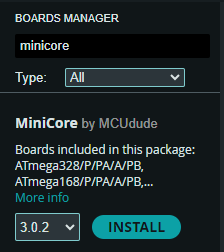
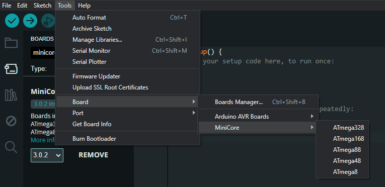
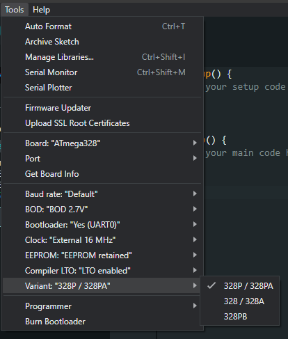
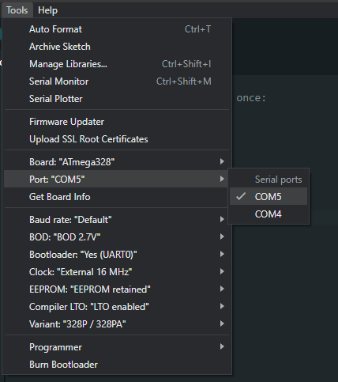
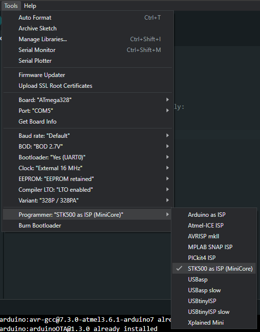
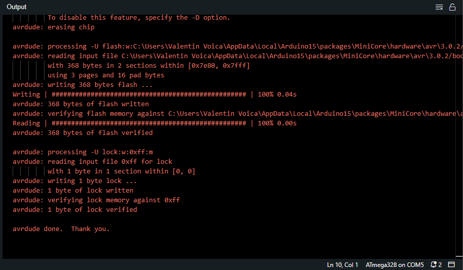

# Burning the bootloader to ATmega328

How to burn the bootloader to ATmega328

[YouTube tutorial](https://www.youtube.com/watch?v=ZscDJ-xO4tA)

Open the Arduino IDE.

## Add the "minicore" core package.

Go to the "File" menu and open "Preferences".

In the "Additional boards manager URLs:" field add the URL below.

https://mcudude.github.io/MiniCore/package_MCUdude_MiniCore_index.json

Choose to show verbose output during upload then click the "OK" button.

Go to the "Tools" menu, select "Board" and open "Boards Manager...".

In the "Filter your search..." box type 'minicore' then click the "INSTALL" button (make sure the "MiniCore" boards are the same as in the screenshot below).

Wait for the install to finish.

Go back to the "Tools" menu, select "Board" then "MiniCore". The "ATmega328" will show in the list.

In the "Tools" menu, options related top the "ATmega328" board are shown:

## Load the bootloader

In the "Tools" menu, make sure the correct port number is selected under the "Port:" option (this must be the "Programming port:" shown in the "Pololu USB AVR Programmer v2 Configuration Utility".

Also in the "Tools" menu, "Programmer" option, select "STK500 as ISP (MiniCore)" as the programmer.

Connect the ISP cable to the Arduino board and power up the Arduino board.

In the "Tools" menu select "Burn Bootloader".

The output should look like the one shown bellow:

